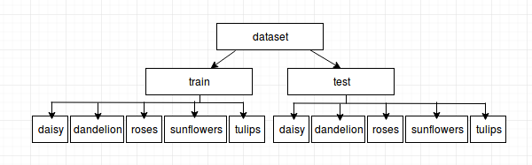
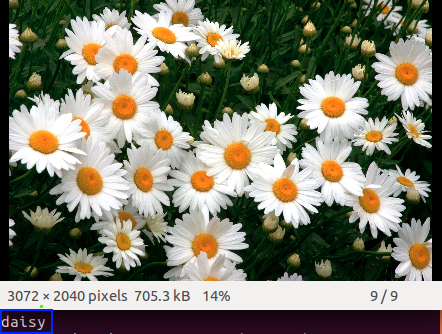

## Flower_Classification_Using_Keras
**Aim** : Classify 5 different types of flowers.<br>
This project is done using Keras.Keras has ImageDataGenerator class which we used in this project allows the users to perform image augmentation on the fly in a very easy way. 

Steps to follow to run the project:<br>
1. Download dataset : To download dataset click **[here](http://download.tensorflow.org/example_images/flower_photos.tgz)** 
Dataset contains 5 folders, each folder represents different flower classses. Change the name of main folder **flower_photos** to
**dataset**.

2. Data Preprocessing : Keras need dataset to be in below format.<br>
 <br>
To convert downloaded data into above format use **Dataset Preparation Keras Format.ipynb** which saggreates data into test(20% of entire data) and train.<br>

3. Training : Once **train** and **test** folders are ready, train model using command
```bash
python cnn.py 
```
    We can change parameters as per our requirements which includes input_shape, batch_size, nb_epoch. Also can modify CNN    architecture by adding more layers and more nodes in each layer etc.

4. Testing : **cnn.py**. will give **model.h5**. To test on any image run below command
```bash 
python test_cnn.py <image_path>
```
5. Sample Result:<br>
<br>


